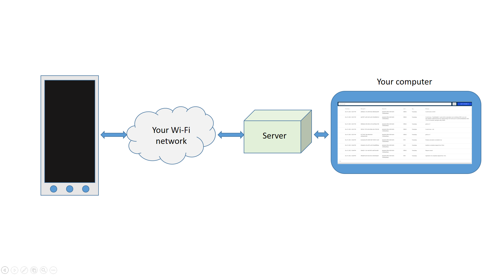

# EasyLog Android application logging tool

**UNDER DEVELOPMENT!!!**

### Overview

EasyLog is a lightweight logging solution designed primarily for Android applications. It provides an easy-to-use API for capturing, storing, and reviewing log entries directly on the device — without requiring a remote backend. Its purpose is to simplify debugging and error tracking during development, testing, and production diagnostics.



[](https://sonarcloud.io/summary/new_code?id=peter-szrnka_easylog)
[](https://sonarcloud.io/summary/new_code?id=peter-szrnka_easylog)
[](https://sonarcloud.io/summary/new_code?id=peter-szrnka_easylog)

### Key Features

- **In-app local logging**
   Capture debug, info, warning, and error messages directly inside your Android application. Logs remain accessible even when the device is offline.
- **Simple and intuitive API**
   Designed to be easy to integrate and use. Developers can start logging immediately with just a few lines of code.
- **Low overhead**
   No unnecessary dependencies. The library is optimized for small footprint and fast operation inside mobile apps.

### Use Cases

- **Debugging during development**
   Inspect application behavior directly on the device, even without access to Android Studio or remote debugging tools.
- **Field diagnostics**
   Useful for testers, field engineers, or beta users who need an easy way to capture and report application behavior.
- **Hybrid logging scenarios**
   Use local logging as the default mechanism, but extend later with optional network or server-side components.

### Why EasyLog?

EasyLog aims to give Android developers a practical, minimalistic logging library that solves real debugging and diagnostic problems without the complexity of larger logging frameworks. It works out of the box for local logging, and it can grow with your needs when you decide to introduce remote logging or backend processing.

### Getting Started

#### Android library

In order to use **EasyLog**, you have to import the [Android Library repository](https://github.com/peter-szrnka/easylog-android-client-library) into your Android app:

> ```
> implementation("com.github.peter-szrnka:easylog-android-client-library:0.0.1")
> ```

Next, you have to set it up. Open your activity and add the following code parts:

> ```
> lateinit var easyLogClient: EasyLogClient
> 
> onCreate() {
> (...)
> easyLogClient = EasyLogClient(this,
>             EasyLogClientConfig(
>                 serviceType = "_easyLog._tcp.",
>                 serviceName = "EasyLogService"
>             )
>         )
>         easyLogClient.start()
> (...)
> }
> 
> override fun onResume() {
>   super.onResume()
>   easyLogClient.resume()
> }
> 
> override fun onPause() {
>   super.onPause()
>   easyLogClient.pause()
> }
> ```

To log any message:

> ```
> EasyLog.d(LOG_TAG,"Update flow completed successfully")
> ```
